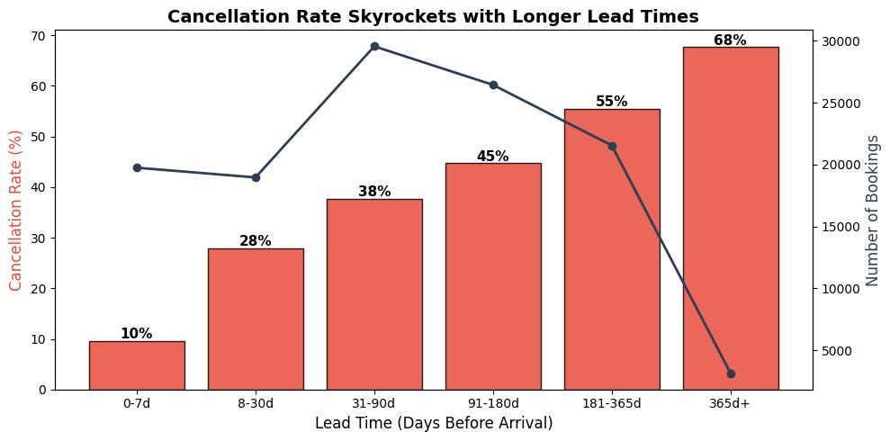

# Predicting Hotel Cancellations: A Data-Driven Approach to Revenue Protection

**One-line hook:** With 37% of bookings ending in cancellation, this analysis identifies the key warning signs and builds a predictive model to help a Portuguese hotel chain protect millions in annual revenue.

---

## The Business Problem

A hotel chain in Portugal is hemorrhaging revenue from last-minute cancellations — more than 1 in 3 bookings never converts into an actual guest stay. Empty rooms can't be resold on short notice, overbooking to compensate creates its own problems (angry guests, costly relocations), and the revenue management team is flying blind without a way to predict which reservations are at risk. If they could flag high-risk bookings weeks in advance, they could proactively intervene — confirm stays, activate waitlists, or adjust pricing to backfill inventory.

## The Data

We analyzed over 119,000 individual hotel bookings spanning 2015–2017, covering both a city hotel and a resort hotel in Portugal. The dataset captures 32 attributes per reservation — everything from how far in advance a guest booked, to what meal plan and room type they requested, to whether they'd stayed before and how they found the hotel (direct, travel agent, corporate, etc.). The target variable is binary: cancelled or not cancelled.

## Key Discoveries

- **Long lead times are the #1 red flag:** Guests who book 6+ months ahead cancel at nearly 3x the rate (~60%) of those who book within a week (~15%). The further out the booking, the more tentative the commitment.
- **No-deposit OTA bookings are the riskiest channel:** Online Travel Agent bookings made with no deposit cancel at significantly higher rates than direct or corporate bookings. OTAs make cancellation frictionless, and it shows.
- **Engaged guests don't cancel:** Guests who make even one special request (parking, high floor, crib) cancel at roughly half the rate of those who make none. Repeat guests cancel at just ~15% compared to ~38% for first-timers. Investment in the stay details signals genuine intent.
- **Room mismatches increase cancellations:** Guests who are assigned a different room type than what they reserved cancel at higher rates — a signal of either availability issues or unmet expectations.

## Visualizing the Story

*Cancellation rates climb steadily with lead time — bookings made 6+ months ahead cancel at nearly 60%, revealing the hotel's biggest revenue risk window.*

## Prediction Model

Our Gaussian Naive Bayes model correctly classifies 77% of all bookings. The key trade-off: it catches about 48% of actual cancellations while keeping false alarms very low at just 5.8%. For a hotel managing 1,000 bookings per month, that means flagging roughly 180 at-risk reservations early enough to intervene, with only about 58 unnecessary follow-up calls. A Logistic Regression model further improved accuracy, confirming that lead time, deposit type, and special requests are the most powerful predictive features.

## Recommendations

1. **Launch a "Commitment Check" for long-lead bookings:** Send automated confirmation emails at 90, 60, and 30 days before arrival for bookings made 200+ days out, offering early check-in perks for reconfirming. Even a 10–15% reduction in long-lead cancellations could recover hundreds of room-nights per year.
2. **Require deposits for high-risk OTA bookings:** Implement tiered deposit requirements — no deposit for bookings under 30 days, partial deposit for 30–180 days, and non-refundable deposit for 180+ days. This could reduce the overall cancellation rate by 5–8 percentage points across the OTA channel.
3. **Invest in repeat guest loyalty:** Repeat guests barely cancel. Enroll every first-time guest who completes a stay into a loyalty program with a rebooking incentive before checkout —
